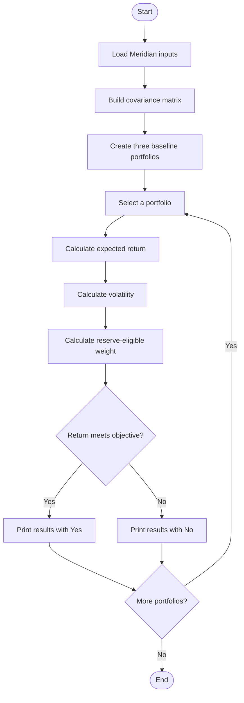

# Lab 15: Portfolio program flowchart

```mermaid
flowchart TD
    A([Start]) --> B[Load Meridian inputs]
    B --> C[Build covariance matrix]
    C --> D[Create three baseline portfolios]
    D --> E[Select a portfolio]
    E --> F[Calculate expected return]
    F --> G[Calculate volatility]
    G --> H[Calculate reserve-eligible weight]
    H --> I{Return meets objective?}
    I -->|Yes| J[Print results with Yes]
    I -->|No| K[Print results with No]
    J --> L{More portfolios?}
    K --> L
    L -->|Yes| E
    L -->|No| M([End])
```
